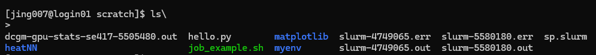

<div align="center">

# Live Demo: How to use UBC Sockeye
Jing Jiang

20250706

</div>

## 1. Connecting to Sockeye

```bash
# From your local terminal:
ssh $USER@sockeye.arc.ubc.ca
```
Once you log in, you will see the Sockeye login node.

 This is a log in node and only available to you. Use it to compile code, transfer files, and submit jobs; avoid running heavy computations here.

```bash
# Go to the project space
cd ../../
cd /arc/project/st-tlwang-1
```
This is the project space where you can store your data and results. It is shared with the whole lab. Make sure to create a directory using your login name.

```bash
# Create a directory for your work      
mkdir $USER
cd $USER
```

```bash
# upload your dataset to the project space (read-only)
scp -r /path/to/your/dataset  $USER@sockeye.arc.ubc.ca:/arc/project/st-tlwang-1/$USER/dataset.csv
```
```bash
# Go to the scratch space (read-write)
cd /scratch/st-tlwang-1
mkdir $USER
cd $USER
```


## 2. Module System & Software
Sockeye uses the Environment Modules system to manage software 
```bash
# List available modules:
module spider

# Sockeye's newest Python is 3.12.7:
module spider python/3.12.7 

# It says we need to load gcc before loading python:
module load gcc/7.5.0 python/3.12.7

# make a virtual environment directory under your home directory or scratch space
python -m venv ~/myenv

# install packages in the virtual environment. For example, we can install numpy and pandas:
source ~/myenv/bin/activate
pip install numpy pandas
```

## 3. Submit a job (Hello)
run job_example.sh

```bash
#SBATCH --cpus-per-task=1         # Request 1 CPU per task
#SBATCH --mem=2G                  # Request 2 GB of memory
#SBATCH --job-name=hello_job      # Job name
#SBATCH -e slurm-%j.err           # Error file (%j will be replaced by the job ID)
#SBATCH -o slurm-%j.out           # Output file
#SBATCH --mail-user=jiangjing.gingercrystal@gmail.com  # Your email for notifications
#SBATCH --mail-type=ALL           # Email notifications for all job events

# Load the necessary Python module (adjust the version if needed)
module load python/3.11.6

# Change to the directory where you submitted the job
cd $SLURM_SUBMIT_DIR

# Create a Python virtual environment
source /scratch/st-tlwang-1/$USER$/myenv/bin/activate


# Create a simple Python script using a here-document
cat > hello.py << 'EOF'
import numpy as np
print("Hello from Sockeye!")
a = np.array([1, 2, 3])
print("Array:", a)
EOF

# Run the Python script
python hello.py
```

```bash
# Submit the job
chmod +x job_example.sh
sbatch job_example.sh

# Check queue
squeue -u $USER

# Inspect a job’s details
scontrol show job <JOBID>

# Cancel if needed
scancel <JOBID>
```
These are the job submission results:

Then we can inspect the output and error files:

```bash
cat slurm-4749065.out
cat hello.py
```

Let's view the output file:
```bash

```
or
```bash
less slurm-5580180.err
q
```

## 4. Set up a R virtual environment


Submit an R job

```bash
module spider R
