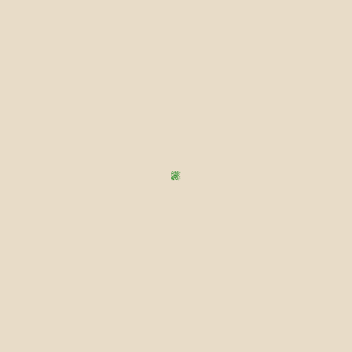
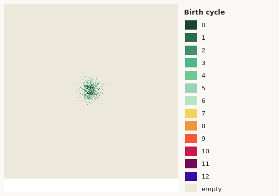
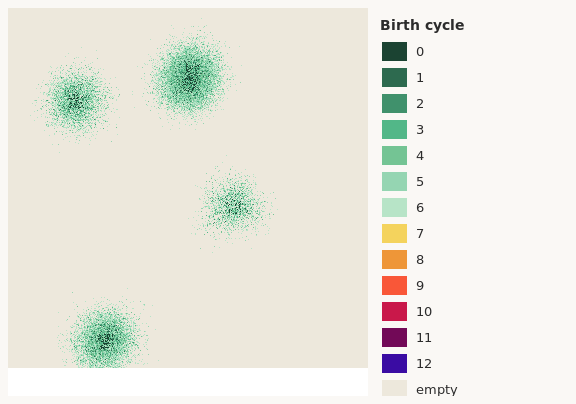
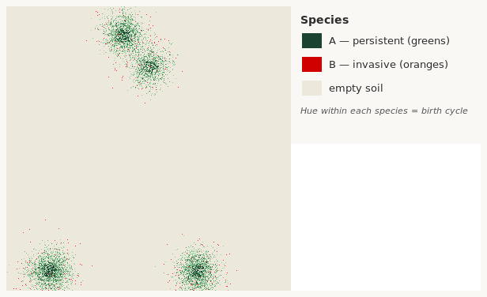
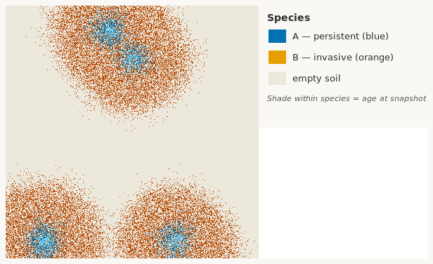
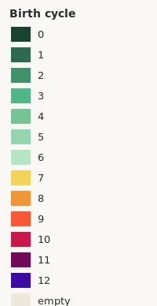
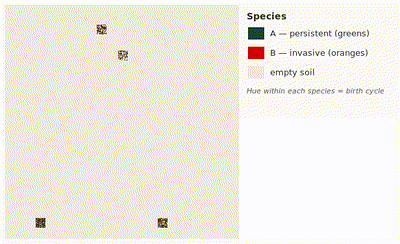

# Tree Seed Spread Simulation: BAM Two-Species Experiment Report

## 1. Overview

Classical ecological niche models (ENMs / SDMs) map species distributions using **environmental variables only**. The BAM diagram reminds us that realized distributions also depend on **Biotic** interactions, **Abiotic** suitability, and **Migration** (dispersal). This experiment extends our grid-based dispersal model toward the **Biotic** and **Migration** axes by simulating **two competing tree species** on the same landscape.

Both species start from the **same founder-cluster layout** (`k = 4` random clusters, 10–100 trees per cluster per species). They disperse under the same abiotic grid (fixed boundaries, circular dispersal neighbourhoods) but differ biologically:

| | Species A | Species B |
|---|-----------|-----------|
| Regeneration | Slower (`reproProbA = 0.35`) | Faster (`reproProbB = 0.85`) |
| Lifespan | Long-lived; never dies | Dies after successful reproduction |
| Competition | 40% chance when both claim a cell | 60% chance (more invasive) |
| Role | Persistent resident | Fast colonizer |

Species A is drawn in **greens**; species B in **oranges/reds** in all visualization outputs.

Serial (`tree2.chpl`) and parallel (`tree_parallel.chpl`) implementations share identical parameters and are compared on the Digital Research Alliance of Canada's **Fir** cluster.

## 2. Simulation Model

### Landscape and encoding

Each cell holds:

| Value | Meaning |
|------:|---------|
| 0 | empty |
| 1 | species A |
| 2 | species B |

The benchmark grid is 1200 × 1200; visualization uses 360 × 360 with the same seed and ecological parameters.

### Dispersal and reproduction

Time advances in synchronous **cycles**. At the start of each cycle, every tree is evaluated:

1. **Neighbourhood presence** — at least one other tree (either species) within dispersal radius `r`.
2. **Room to land** — at least one empty cell in the same disk.
3. **Regeneration draw** — species A reproduces with probability 0.35; species B with 0.85.

If all conditions pass, the parent chooses a random empty cell in its disk. **Species B's parent dies** at cycle end if it successfully reproduced.

### Interspecific competition

When species A and species B both claim the same empty cell in one cycle, a pre-drawn random number resolves the contest: **B wins 60%**, **A wins 40%**. This captures B's invasive advantage at establishment while A accumulates over time because adults persist.

### Initialization

For each of `k` clusters, a random size and centre are drawn. Species A and species B each plant that many founders in the same cluster region (rejection sampling in a small box around the centre). Both species therefore share cluster locations but intermix within each patch.

### Reproducibility

Founder placement and dispersal use independent RNG streams. The parallel code pre-draws per-cell random numbers each cycle so thread scheduling does not alter outcomes.

## 3. Benchmark Design

Runs were submitted to SLURM on Fir (`cpubase_bycore_b1`), allocating 1 node, 32 CPUs, and 16 GB RAM. Chapel 2.4.0 (`chapel-multicore`) was loaded via environment modules.

| Parameter | Value |
|-----------|-------|
| Grid size | 1200 × 1200 |
| Cycles | 12 |
| Founder clusters (`k`) | 4 |
| Trees per cluster per species | 10–100 (uniform random) |
| Dispersal radius | 15 |
| `reproProbA` / `reproProbB` | 0.35 / 0.85 |
| `winProbB` (interspecific) | 0.60 |
| Random seed | 12345 |
| Repetitions | 3 per configuration |
| Thread counts | 1, 2, 4, 8, 16, 32 |

Speedup is relative to the serial baseline. Correctness is verified by matching total tree counts (and species breakdown) between serial and parallel runs.

## 4. Results

**Serial baseline** (`tree2.chpl`): **0.636 s** mean, final count **9 195** (A = 8 970, B = 225).

| Threads | Mean time (s) | Speedup | Tree count |
|--------:|--------------:|--------:|-----------:|
| 1 | 0.884 | 0.72 | 9 195 |
| 2 | 0.450 | 1.41 | 9 195 |
| 4 | 0.237 | 2.68 | 9 195 |
| 8 | 0.134 | 4.74 | 9 195 |
| 16 | 0.079 | 8.08 | 9 195 |
| 32 | 0.052 | 12.27 | 9 195 |

All parallel runs matched the serial species counts exactly.

## 5. Discussion

Despite species B's faster regeneration and 60% competitive advantage on contested cells, **species A dominates by cycle 12** (8 970 vs 225 trees on the benchmark grid). B's semelparous life history — dying after each successful reproduction — limits standing biomass even though it colonizes aggressively in early cycles. A's persistent adults accumulate and retain territory, illustrating how **biotic life-history traits** can outweigh short-term invasive advantage on a shared landscape.

This is precisely the kind of process absent from environment-only ENMs, and motivates coupling dispersal and competition modules with abiotic suitability layers in future work.

Parallel speedup reaches **12.3×** at 32 threads (0.636 s → 0.052 s). The two-species conflict-resolution phase adds work per cycle but remains highly parallelizable at this grid size.

## 6. Visualization

`tree_viz.chpl` writes PPM frames coloured by **species** (green vs orange palettes) with hue shading by birth cycle within each species. `tree_visualize.sh` builds PNGs, a two-species legend, and MP4 videos per thread count.

### Key frames (360 × 360 grid, same seed)

| Cycle | Total | Species A | Species B |
|------:|------:|----------:|----------:|
| 0 | 630 | 315 | 315 |
| 3 | 1 035 | 742 | 293 |
| 6 | 2 068 | 1 796 | 272 |
| 9 | 4 445 | 4 189 | 256 |
| 12 | 9 431 | 9 214 | 217 |

| Cycle 0 | Cycle 3 | Cycle 6 |
|:-------:|:-------:|:-------:|
|  |  |  |
| Cycle 9 | Cycle 12 | Legend |
|  |  |  |

*Green = species A (persistent). Orange/red = species B (invasive, semelparous).*

### Spread animation

*Animated GIF (2 fps) from the 1-thread run. Full-quality video: [tree_spread_t01.mp4](viz/t01/tree_spread_t01.mp4).*

| Threads | Video |
|--------:|-------|
| 1 | [tree_spread_t01.mp4](viz/t01/tree_spread_t01.mp4) |
| 2 | [tree_spread_t02.mp4](viz/t02/tree_spread_t02.mp4) |
| 4 | [tree_spread_t04.mp4](viz/t04/tree_spread_t04.mp4) |
| 8 | [tree_spread_t08.mp4](viz/t08/tree_spread_t08.mp4) |
| 16 | [tree_spread_t16.mp4](viz/t16/tree_spread_t16.mp4) |
| 32 | [tree_spread_t32.mp4](viz/t32/tree_spread_t32.mp4) |

## 7. Artifacts

| File | Description |
|------|-------------|
| `tree2.chpl` | Serial two-species implementation |
| `tree_parallel.chpl` | Parallel two-species implementation |
| `tree_viz.chpl` | Parallel simulator with species-coloured PPM output |
| `tree_benchmark.sh` | SLURM benchmark driver |
| `tree_visualize.sh` | SLURM visualization pipeline |
| `tree_scaling_45702922.csv` | Scaling summary (CSV) |
| `viz/figures/` | Key-frame stills, legend, and spread GIF |
| `viz/t*/tree_spread_*.mp4` | Spread animation per thread count |

## 8. Key hyperparameters

| Parameter | Chapel `config` default | Benchmark / viz (`*.sh`) |
|-----------|-------------------------|--------------------------|
| `k` | 4 | `--k=4` |
| `minTreesPerCluster` / `maxTreesPerCluster` | 10 / 100 | same |
| `reproProbA` / `reproProbB` | 0.35 / 0.85 | same |
| `winProbB` | 0.60 | same |
| `radius` | 5 (chpl) / 15 (viz) | `--radius=15` |
| `rows` / `cols` | 60 (chpl) / 360 (viz) | 1200 (bench) / 360 (viz) |

Change `k`, regeneration rates, or competition odds in the bash `ARGS` / `SIM_ARGS` arrays, or pass `--flag=value` on the command line.
